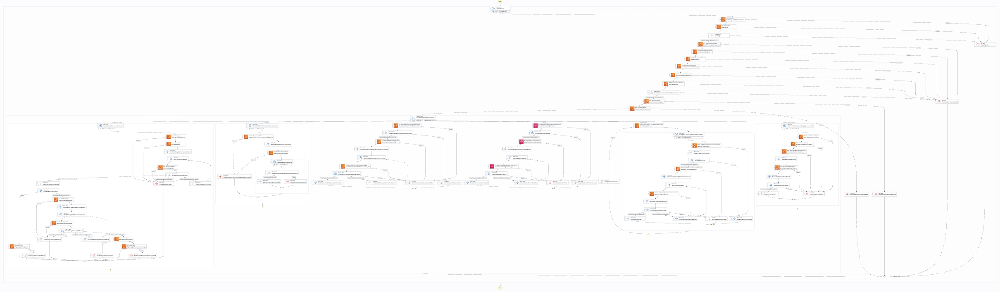
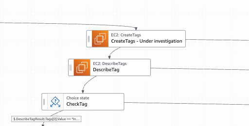
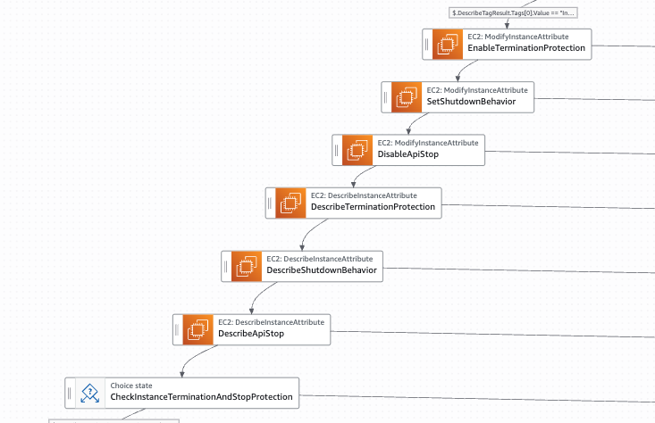
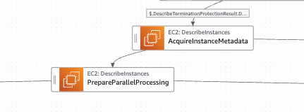
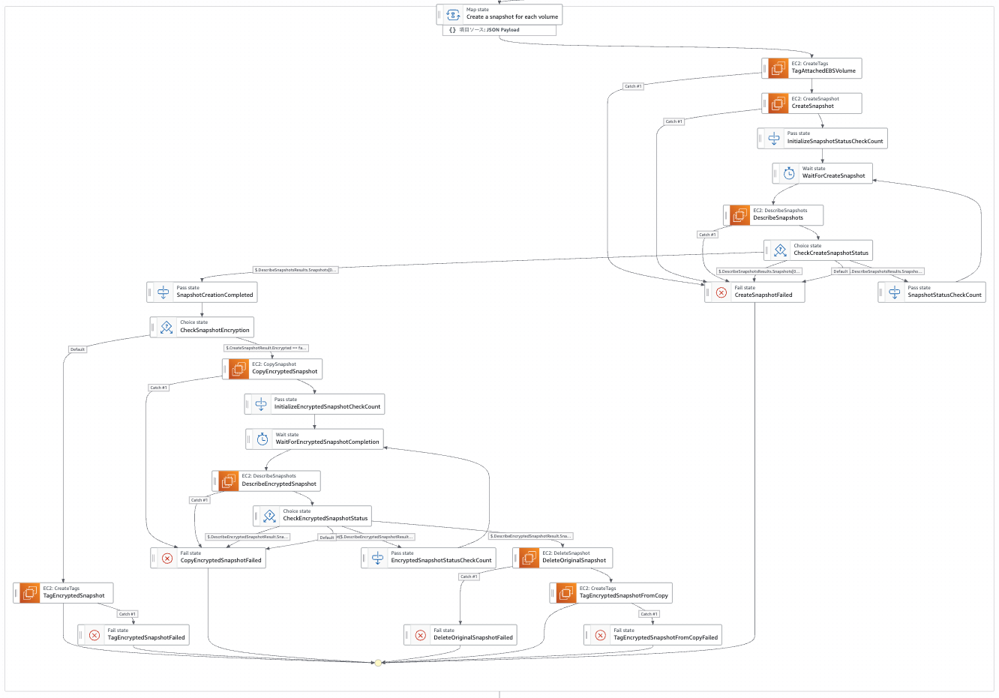
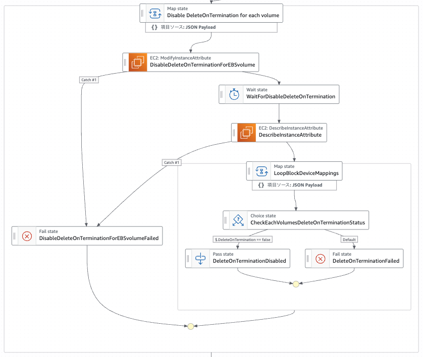
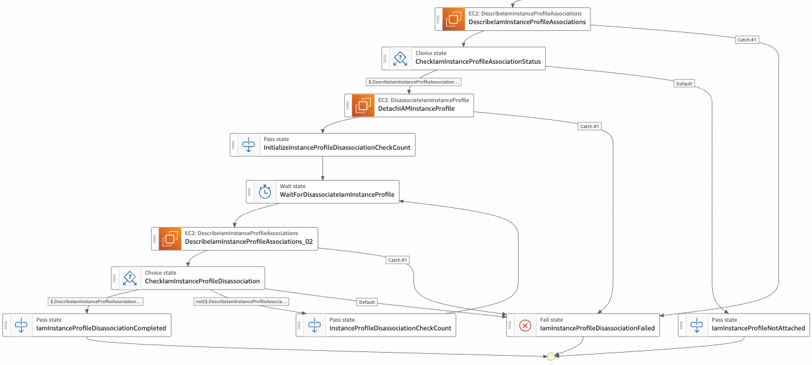
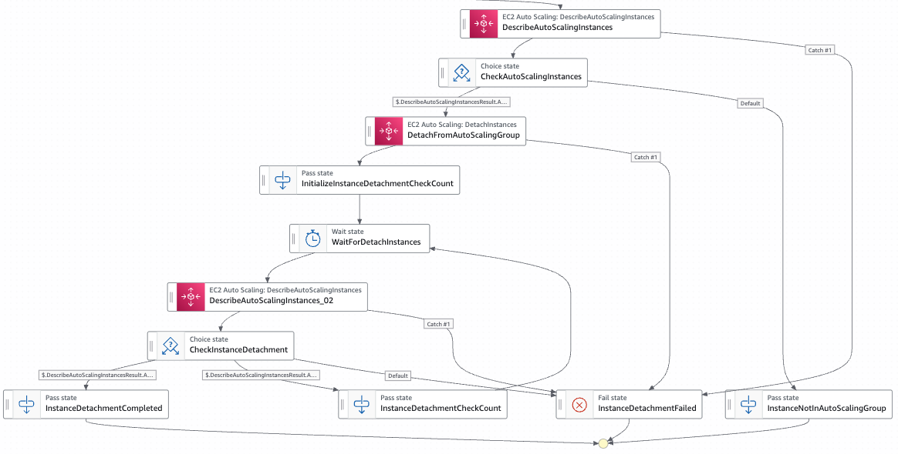
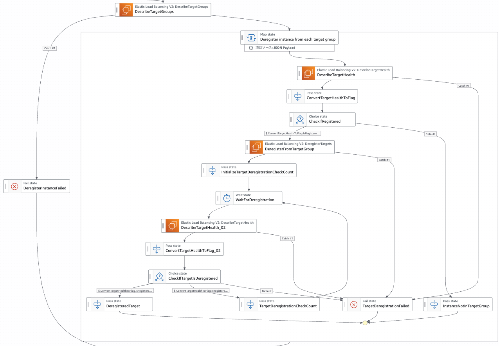
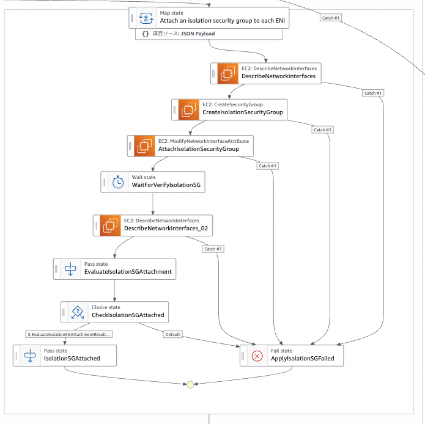

# State Machine for Essential Incident Response Tasks
## ユースケース
AWSにおけるセキュリティインシデントレスポンスの手順は複数のドキュメントに記載されており理解が複雑になっています。

このユースケースでは、EC2インスタンスにセキュリティインシデントが発生した場合を想定し必須となるインシデントレスポンス手順を自動化しています。

## 自動化の目的
自動化の目的は迅速なインシデントレスポンスの実行とヒューマンエラーの発生を防ぐことです。

- インシデントレスポンスは状況を確認しながら手作業で行われることが多い
- しかし、その中でも必須となる手順は存在する
- 時間的なプレッシャーや精神的なストレスは、ヒューマンエラーのリスクを大幅に高める

## 利用ツール
このツールは下記の条件を満たす AWS Step Functions を利用しています。
- プログラミングスキルを必要としないこと
- ワークフローを構築できること
- ワークフロー、実行結果が可視化できること
- メンテナンスが属人化しないこと
- 実行開始までの時間および処理速度が速いこと

## 制限事項
このツールは法律的に有効な証拠としてデータを取得することは目的としていません。

## ステートマシン


## デプロイ
AWS Serverless Application Modelを使ってデプロイします。必要なIAMポリシー、IAMロールは同時に作成されます。
```
sam build
sam deploy --guided
```

「sam deploy --guided」実行時にパラメーターの確認を求められますので、それぞれ任意の値を指定してください。

- StateMachineName：ステートマシン名
- LogLevel：ステートマシンのログレベル
- MaxConcurrency：最大同時実行数（

```
Setting default arguments for 'sam deploy'
=========================================
Stack Name [sam-app]: essential-incident-response-tasks
AWS Region [ap-northeast-1]: ap-northeast-1
Parameter StateMachineName []: essential-incident-response-tasks
Parameter LogLevel [ALL]: ALL
Parameter MaxConcurrency [5]: 10
#Shows you resources changes to be deployed and require a 'Y' to initiate deploy
Confirm changes before deploy [y/N]: N
#SAM needs permission to be able to create roles to connect to the resources in your template
Allow SAM CLI IAM role creation [Y/n]: Y
#Preserves the state of previously provisioned resources when an operation fails
Disable rollback [y/N]: N
Save arguments to configuration file [Y/n]: Y
SAM configuration file [samconfig.toml]: samconfig.toml
SAM configuration environment [default]: default
```

## ステートマシンの起動
ステートマシン起動時にインスタンスID、リージョンを入力したJSONデータをインプットします。1回の実行につき１つのリージョンのみ指定できます。
デフォルトの設定では最大５インスタンスまで同時実行可能（MaxConcurrencyで指定）です。

```json
{
  "InstanceIds": [
    "i-01234567890123456",
    "i-12345678901234567"
  ],
  "Region": "ap-northeast-1"
}
```

## ステートマシンの各処理

### 調査対象のインスタンスへ調査中タグを設定する
調査対象のインスタンスを判断できるように調査中とわかるタグを設定します。
タグの内容は「CreateTags - Under investigation」ステートのパラメーターで指定できます。



```json
{
  "Resources.$": "States.Array($.InstanceId)",
  "Tags": [
    {
      "Key": "SecurityIncidentStatus",
      "Value": "Investigation"
    }
  ]
}
```

### インスタンスの終了保護を有効にして、インスタンス停止処理を無効化する
インスタンスの終了保護を有効化にすることで分析対象とするデータが消失することを防ぎます。
またインスタンスの停止処理を無効化することで揮発性データの消失を防ぎます。



### インスタンスメタデータの取得
分析対象のデータとしてインスタンスメタデータを取得します。
取得したインスタンスメタデータはステートマシンの実行結果に記録されます。



### EBSスナップショットの取得と暗号化 （Parallelステート内で他のタスクと並列で実行されます）
インスタンスにアタッチされているEBSボリュームのスナップショットを取得します。
取得したスナップショットが暗号化されていない場合、暗号化したスナップショットとしてコピーを行い、元のスナップショットは削除します。
それぞれのスナップショットには、アタッチされていたインスタンスIDと調査中であることを示すタグが設定されます。
デフォルトでは最大30のボリュームまで対応していますが、CreateSnapshot APIの同時実行数を超えてしまう可能性があります。
その場合は、同時実行の対象とするインスタンス数を減らすなどの調整が必要となります。



### インスタンス終了時のボリューム削除を無効化 （Parallelステート内で他のタスクと並列で実行されます）
インスタンス終了時にアタッチされているEBSボリュームが自動的に削除されないようにDeleteOnTerminationを無効化します。



### インスタンスプロファイルのデタッチ （Parallelステート内で他のタスクと並列で実行されます）
EC2インスタンスからインスタンスプロファイル(IAMロール)をデタッチします。
対象のインスタンスから他のAWSサービスにアクセスされることを防ぎます。



### オートスケーリンググループからデタッチ （Parallelステート内で他のタスクと並列で実行されます）
EC2インスタンスをオートスケーリンググループからデタッチします。
オートスケーリンググループに信頼されていないインスタンスが含まれることを防ぎます。



### ターゲットグループからデタッチ （Parallelステート内で他のタスクと並列で実行されます）
EC2インスタンスをターゲットグループからデタッチします。
ロードバランサーからのリクエストが信頼されていないインスタンスに到達することを防ぎます。



### 隔離用セキュリティグループの作成とアタッチ （Parallelステート内で他のタスクと並列で実行されます）
EC2インスタンスをネットワークから隔離するためのセキュリティグループを作成します。
隔離用セキュリティグループには許可ルールが存在しないため全ての通信を遮断します。
対象のEC2インスタンスにアタッチされている全てのENIに隔離用のセキュリティグループをアタッチします。



### エラー処理
ステートマシンには下記のエラー処理を実装しています。

- 全てのステートにリトライ処理、エラーキャッチを設定
- 設定を変更する処理後には設定が反映されていることを確認するチェック処理
- スナップショット取得処理実行後にスナップショットが作成されたことを確認するチェック処理
- 自動化したインシデントレスポンスが正常に終了していないことを見落とさないことを優先し、Parallelステート内で並列処理されるタスクにエラーが発生した場合はその時点でステートマシンが異常終了します

## ロードマップ
- Systems Managerと連携したOS内の揮発データ取得処理
- フォレンジックアカウントへのスナップショットデータ移動