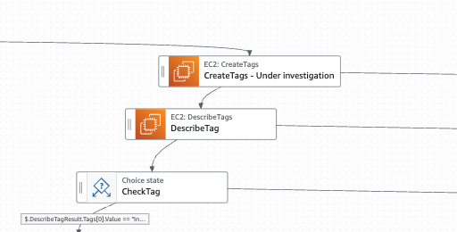
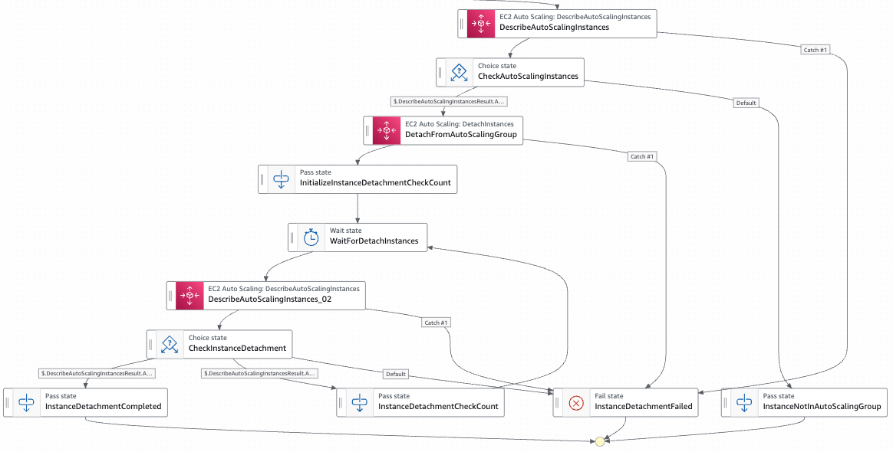

# State Machine for Essential Incident Response Tasks
## Use Case
Security incident response procedures on AWS are described across multiple official documents, making them difficult to fully understand and execute consistently.

This use case focuses on automating the essential response steps when a security incident occurs on an EC2 instance.

## Purpose of Automation
The purpose of automation is to enable rapid response and reduce the risk of human error.
- Incident response is often performed manually while assessing the situation.
- However, some steps are always required regardless of context.
- Time pressure and psychological stress significantly increase the likelihood of human error.

## Incident Response Actions Covered by This Tool
1.  Tag the target EC2 instance to indicate it is under investigation
2.	Detach the IAM instance profile from the target EC2 instance
3.	Detach the target EC2 instance from the Auto Scaling Group
4.	Deregister the target EC2 instance from the target group
5.	Detach security groups from all ENIs attached to the target EC2 instance and attach an isolation security group
6.	Collect instance metadata from the target EC2 instance
7.	Enable termination protection and stop protection on the target EC2 instance
8.	Disable the DeleteOnTermination attribute for all EBS volumes attached to the target EC2 instance
9.	Create snapshots of all EBS volumes attached to the target EC2 instance

## Reasons for Choosing AWS Step Functions
This tool uses AWS Step Functions, which meets the following criteria:
- Does not require programming skills
- ßAbility to build and operate workflows
- Provides visibility into workflows and execution results
- Easy to maintain without being dependent on specific individuals
- Fast execution and short time to launch

## AWS Services Used
- AWS Step Functions
- AWS IAM
- ßAmazon CloudWatch Logs (for storing Step Functions execution logs)

## Limitations
This tool is not intended for collecting data as legally admissible evidence.

## State Machine Diagram


## Deployment
Deploy using the AWS Serverless Application Model. The required IAM policies and IAM roles will be created automatically during the deployment.
```
sam build
sam deploy --guided
```

During sam deploy --guided, you will be prompted to provide the following parameters. 

Specify appropriate values as needed:
- StateMachineName: Name of the state machine
- LogLevel: Logging level for the state machine
- MaxConcurrency: Maximum number of concurrent executions


```
Setting default arguments for 'sam deploy'
=========================================
Stack Name [sam-app]: essential-incident-response-tasks
AWS Region [ap-northeast-1]: us-east-1
Parameter StateMachineName []: essential-incident-response-tasks
Parameter LogLevel [ALL]: ALL
Parameter MaxConcurrency [5]: 10
#Shows you resources changes to be deployed and require a 'Y' to initiate deploy
Confirm changes before deploy [y/N]: N
#SAM needs permission to be able to create roles to connect to the resources in your template
Allow SAM CLI IAM role creation [Y/n]: Y
#Preserves the state of previously provisioned resources when an operation fails
Disable rollback [y/N]: N
Save arguments to configuration file [Y/n]: Y
SAM configuration file [samconfig.toml]: samconfig.toml
SAM configuration environment [default]: default
```

## Starting the State Machine
To start the state machine, provide input in JSON format specifying instance IDs and the region.
Only one region can be specified per execution.
By default, up to five EC2 instances can be processed in parallel.(Specified by the MaxConcurrency parameter)

```json
{
  "InstanceIds": [
    "i-01234567890123456",
    "i-12345678901234567"
  ],
  "Region": "ap-northeast-1"
}
```

## Step-by-Step Breakdown of the State Machine

### Apply an “Under Investigation” tag to the compromised instance
Apply a tag indicating “Under Investigation” to help identify the compromised instance.
The tag can be configured in the parameters of the “CreateTags – Under investigation” state.



```json
{
  "Resources.$": "States.Array($.InstanceId)",
  "Tags": [
    {
      "Key": "SecurityIncidentStatus",
      "Value": "Investigation"
    }
  ]
}
```

### Enable termination protection and disable shutdown behavior
Enabling termination protection helps prevent the loss of data required for investigation.
Disabling the instance’s shutdown behavior protects volatile data from being erased.
A Choice state checks that termination protection is enabled and shutdown behavior is disabled before proceeding to the next step.


### Collect Instance Metadata
Instance metadata is collected as part of the data to be analyzed.
The retrieved metadata is recorded in the Step Functions execution results.


### Create and Encrypt EBS Snapshots (Executed in Parallel with Other Tasks)
Snapshots are taken of all EBS volumes attached to the instance.
If a snapshot is not encrypted, it is copied as an encrypted snapshot, and the original unencrypted snapshot is deleted.
Each snapshot is tagged with the instance ID it was attached to and marked as Under Investigation.

By default, up to 30 volumes are supported. However, if the number of parallel CreateSnapshot API calls exceeds the service limit, you may need to adjust the number of instances processed concurrently.


### Disable DeleteOnTermination for Attached Volumes (Executed in Parallel with Other Tasks)
To prevent EBS volumes from being automatically deleted when the instance is terminated, the DeleteOnTermination attribute is disabled.


### Detach Instance Profile (Executed in Parallel with Other Tasks)
Detach the instance profile (IAM role) from the EC2 instance.
This prevents the compromised instance from accessing other AWS services.


### Detach from Auto Scaling Group (Executed in Parallel with Other Tasks)

Detach the EC2 instance from the Auto Scaling group.
This prevents untrusted instances from remaining in the Auto Scaling group.



### Detach from Target Group (Executed in Parallel with Other Tasks)

Detach the EC2 instance from the target group.
This prevents requests from the load balancer from reaching an untrusted instance.


### Create and Attach Isolation Security Group (Executed in Parallel with Other Tasks)

Create a security group to isolate the EC2 instance from the network.
The isolation security group contains no allow rules, effectively blocking all traffic.
It is attached to all ENIs associated with the target EC2 instance.


## Error Handling

The state machine implements the following error handling mechanisms:
-	Retry and catch configurations are applied to all states
- After each configuration change, a follow-up check ensures that the setting has been successfully applied
-	After snapshot creation tasks, a check confirms that the snapshots were properly created
- To ensure no failures in the automated incident response are overlooked, the state machine is designed to fail immediately if any task within a Parallel state encounters an error.


## Roadmap
-	Implementing volatile data collection from within the OS via Systems Manager
-	Transferring snapshot data to a dedicated forensic account